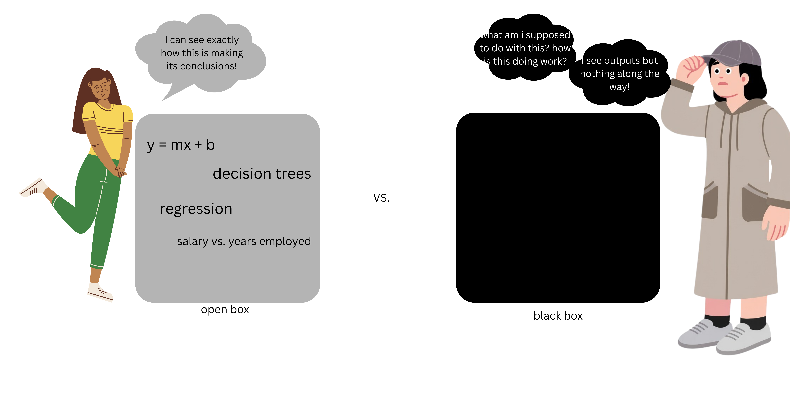

This will contain my work for DTSC 330 -
Big Data & Databases during the Spring 2026
semester @ Duquesne University. 

Homework #1
Set up GitHub & the first repository!

Homework #2 (due Feb. 1st)

How do you fill in the missing dates from the grants data?

You can use the last available date or the date of the proceeding
data collected. This could likely be a misrepresentation, though.
Multiple observations taken @ the "same time" may rupture the 
data.

PI_NAMEs contains multiple names. We can only connect individual 
people. Can you make it so that we can get "grantees"?

Utilize pandas function explode()? I will use that function to send the ID number ( assuming the possibility of 
a second one in one element ) to the following line.

The dates for Articles are problematic. Can you fix them?

I am super unfamiliar with this file type which made this more difficult for me to navigate this question.

Homework #3 ( due Feb. 8th )

"""Create the best possible classifier of sleep from acceleration and heart rate
If we have not finished the associated readers by the end of class, you will have to complete these readers yourself
The classifier should be written using the technique used in class:
Code should have docstrings
The outermost code you write should be in a script that imports and uses reusable_classifier (or a specific version thereof)
The code should also import and use any necessary readers
Any transformations to the raw data should be done in the reader
As before, please add a short description to your README that returns the performance of your model and no more than one paragraph on why you chose the features you did"""

This loads wrist-worn heart rate & accelerometer data
& prepares it for the task of sleep classification. To find the rolling means for this set, it first converts the raw data into its absolute values to avoid the effects of direction. The rolling means are then computed over their respective fixed windows to approximate the behavior over time. It is downsized to reduce the redundancy, keeping about one observation per second. The sleep labels are separated from its features for the random forest classifier to learn its patterns to distinguish one's
sleep from wakefulness. 

Homework #4 ( due Feb. 15th )

Add XGBoost to your reusable classifier
For those who did not structure the assessment to be between people (instead using a simple train_test_split), refactor your code to be between people. You can reference my code.
Compare the performance of XGBoost with Random Forest and add the difference (one sentence) to your README.md.
Install fasttext and embed a single word.
Referencing what we've discussed throughout the course up to this point, create an explanation of machine learning.
You can eventually adapt this into a Medium or LinkedIn post to help prepare for a job search
Nothing shows understanding better than teaching
This should be about one page and must include both a diagram and a description. The weight of one vs the other is up to you. The diagram MUST be your own-- it cannot be taken from the internet. Similarly, I would prefer a wrong answer over one created by a large language model. Think of this as preparation for the Performance Review (Midterm) and Job Interview (Final Exam).
Must be in the form of a Markdown (.md) file with an imported image
I would recommend covering the key concepts:
Features
Labels
Classification vs regression
Parameters
Black box vs open box
Different models that we've discussed and how to choose from amongst them
Data vs features
Training data requirements
Anything else that's interesting

The accuracy of XGB took the classifier from 0.9914893617021276 to 0.9942127659574468 accuracy. (the one second window test)

Machine learning is the process of teaching a computer how to perform a task without explicitly coding it. This includes feeding data into an algorithm, which helps it to improve its outcomes, although gradually. 

Data is essential to this process... you need to have this raw information, which later will be split into training & testing data. 
** THIS MUST BE CLEAN DATA, AS THE OUTCOMES WILL BE A REFLECTION OF THE DATA INSERTED **

FEATURES VS. LABELS
features - raw data turned into measurable inputs, these will help to make the predictions
labels - the TARGET the model wants to predict

TRAINING VS. TESTING DATA
training - this portion of the data is utilized to teach the algorithm
    reducing error here comes from parameters(increase model parameters) 
testing - a separate portion of data that helps to evaluate how well the model can draw its conclusions

what is an algorithm?
a set of mathematical instructions that help the maching learn from the provided data
 - different types of algorithms have their own respective purposes for specific problems

COMMONLY USED ALGORITHMS
    statistical models - mathematical equations to model relationships

    decision trees - diagram-like structures
    feature values
    best for interpretation

    neural networks - similar to the human brain
    adjustable weights help them learn patterns

COMMON MACHINE LEARNING ISSUES
classification * - predicting categories
     disease vs. no disease
    ovulatory vs. anovulatory cycles
THRESHOLDS can be important here

regression - continuous numerical values
    inflation
    weather
    job / house markets

what is a model?
models take new data as its input & returns a prediction 
these are trained on data to understand its patterns

how do we choose a model? what are they?
OPEN BOX - very transparent
    instrumental in displaying how features can alter predictions 
ex ) linear / logistic regression, decision trees

BLACK BOX - hard to interpret
    complex, but accurate
    cannot "see inside"
    essentially less aware of the processes
ex) random forests, neural networks

choosing factors - 
    desire for interpretability !!!!
    complexity of data
    accuracy requirements

HOW IT ALL FITS TOGETHER

Together, these pieces form the machine learning process: data -> features, the algorithms adjust parameters to learn these patterns, leaving a model that is to be tested for its generalization accuracy. The goals & complexity does vary, but machine learning ultimately works by taking a clean set of data with a thoughtful model and using the appropriate evaluation tools to turn information into accurate predictions.  

Homework #5 ( due Feb. 22nd )

Homework 5:

Create entity resolution training data via simulation
The number of rows is up to you
As are error styles
Should include forename, surname
Can include initials, affiliations
Add 2-3 sentences to your README.md answering the following WITH NO LLM/GOOGLE HELP:
What is the simplest way you can think of to limit the phonebook-to-phonebook matching problem such that you do not have to do an all-to-all comparison?
You can do this. You don't need any information other than thinking of a phone book.
You have first name, last name, address, and phone number in each.
You must compare two phone books with the above information.
You cannot propose a solution that compares every entry in phone book 1 to every entry in phone book 2.

I think the easiest way to try and eliminate this issue is to take the first initial and full last name, and the last two of the zip code. Assuming that most people started their name with the correct letter, and finished their zip-code properly. This should reduce the number of unknown pairs and preserve our true matches. 

Homework #6 ( due March 8th )

SPRING BREAK

Homework #7 ( due March 15th )

Create a SQLite database for our datasets
Create tables for Articles and Grants
Create bridge table
Add a function to insert data from Articles and Grants into the database via SQLAlchemy and Pandas

Homework #8 ( due March 22nd )

You may not ask any questions of an LLM. You may ask as many questions as you want from me. You may ask some questions of your peers, but if any of them are "what's the answer for..." that's not allowed.
This is another homework to build intuition. We have been talking about entity resolution. As of this week, we have covered everything that makes up an entity resolution pipeline.
What is entity resolution?
Relate every single week's work up to now to entity resolution. The first few weeks will be the hardest, because they are more abstractly related.
You should be able to relate the human activity recognition dataset to entity resolution. Not directly, but rather you should understand that we were learning a core conept about machine learning. What was it?
The output should be in the form of a markdown (.md) file. Graphics are optional.
The output should be either paragraphs or a bulleted list.
If I believe that you've used an LLM to write this, 1. you are wasting an opportunity and 2. I will ask you to explain entity resolution directly to me in greater depth. If you cannot answer to my satisfaction, the homework will be marked uncompleted and will directly affect your grade.

entity resolution, stated simply, is the act of connecting information within datasets or between more than one dataset using machine learning. machine learning, as it relates to entity resolution, learns by building pattern recognition. this helps it to be more susceptible to similar, but not exact entries. without machine learning, it would be common to match up pairs by hand, or accept fuzzy / messy matches that may not even be true matches. 

when we handled missing data, entity resolution can play its part by leveraging the other information we had to fill in the missing dates. whether it can pull from prior entries or the following one, it is working by using what it already has to learn how to continue to fill in where it is missing in the future. another step along the way was the explode (pandas) function which helped to handle entries with more than one name per entry (one-to-many) relationships. this ensures that making comparisons is simpler. 

when creating the best possible sleep classifier from acceleration / heart rate, it is easy to relate this task to entity resolution. these both required transforming noisy raw data into meaningful features / insights. in this instance, the sleep classifier helped to reshape acceleration into something that could classify sleep quality. 

when we applied xgboost to our classifiers, mine personally did better than without. xgboost ties into entity resolution because it trains itself through adaptating to previous inputs. 

training data that was created in week 5 for this is instrumental in defining entity resolution as it all ties into using machine learning to create matches. there are many different things that could have been slightly different per "almost match" in this specific instance. the training data gives an example of just one way these error types can look. 

finally, this past week we used SQLite to create a database to hold our articles and grants data. the database itself was helpful to store raw data where it can be standardized and manipulated. having everything in the same place helps to let us identify and merge duplicate records. 

